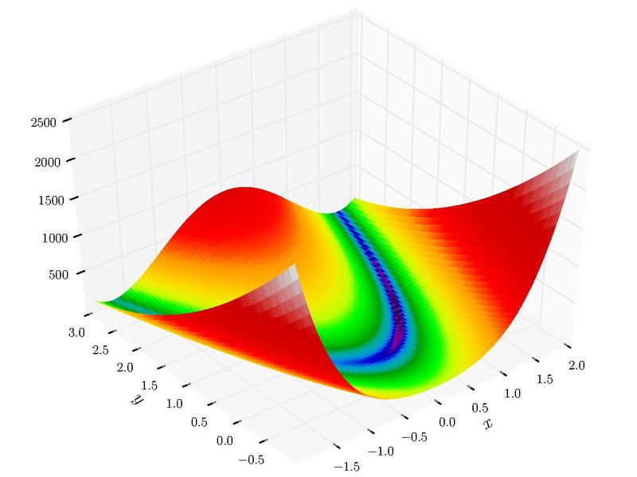

```{r setup, include=FALSE}
knitr::opts_chunk$set(echo = TRUE)
```

## Wstępne założenia

Wybraliśmy dwa algorytmy spośród zaproponowanych:

-   **Poszukiwanie przypadkowe (Pure Random Search)**

-   **Algorytm Genetyczny (GA)**

Oraz dwie funkcje z pakietu *smoof*:

-   *Funkcja Rosenbrocka\
    *

-   *Funkcja Schwefela\
    *

Ustawiamy seed, żeby wyniki były powtarzalne dla kolejnych uruchomień.

```{r}
set.seed(2137)
```

Definiujemy również funkcje dla zadanych wymiarów (*n= 2, n=10, n=20)*

```{r echo=TRUE, results='hide', warning=FALSE, error=FALSE, message=FALSE}
library(smoof)
library(GA)
library(ecr)
rosenbrock2d <- makeRosenbrockFunction(2)
rosenbrock10d <- makeRosenbrockFunction(10)
rosenbrock20d <- makeRosenbrockFunction(20)

schwefel2d <- makeSchwefelFunction(2)
schwefel10d <- makeSchwefelFunction(10)
schwefel20d <- makeSchwefelFunction(20)
```

## Definiowanie losowych punktów

Funkcja zwracająca losowy punkt dla **rozkładu jednostajnego**. Na podstawie dobranych wyżej funkcji zakładam że dziedziny są symetryczne

```{r echo=TRUE}
getRandomPointInUD <- function(dimensions, domain){
  rndPoint <- replicate(n=dimensions, runif(1,-domain,domain))
  return(rndPoint)
}

```

## Szukanie minimalnej wartości funkcji I

Zgodnie z dokumentacją dla porównania PRS-GA określamy budżet obliczeniowy jako 1000 wywołań. Czyli losujemy 1000 punktów i szukamy najmniejszej wartości.

Definiujemy funkcję odpowiedzialną za szukanie minimum wartości funkcji podanej jako argument. W ten sposób unikniemy powtarzania kodu

```{r}
getSmallestVal <- function(numberOfExec,givenFunc, pointsGenerator, dimensions, domain){
  generatedPoints <- replicate(numberOfExec, pointsGenerator(dimensions, domain))
  pointsMat <- matrix(generatedPoints, nrow = numberOfExec)
  res <- apply(pointsMat, 1, givenFunc)
  return(min(res))
}
```

### Dla PRS

```{r}
Rosenbrock2dResultsPRS <- replicate(50, getSmallestVal(1000, rosenbrock2d, getRandomPointInUD,2,30))
Rosenbrock10dResultsPRS <- replicate(50, getSmallestVal(1000, rosenbrock10d, getRandomPointInUD,10,30))
Rosenbrock20dResultsPRS <- replicate(50, getSmallestVal(1000, rosenbrock20d, getRandomPointInUD,20,30))

Schwefel2dResultsPRS <- replicate(50, getSmallestVal(1000, schwefel2d, getRandomPointInUD, 2, 500))
Schwefel10dResultsPRS <- replicate(50, getSmallestVal(1000, schwefel10d, getRandomPointInUD, 10, 500))
Schwefel20dResultsPRS <- replicate(50, getSmallestVal(1000, schwefel20d, getRandomPointInUD, 20, 500))


MeanRosenbrock2dPRS <- mean(Rosenbrock2dResultsPRS)
MeanRosenbrock10dPRS <- mean(Rosenbrock10dResultsPRS)
MeanRosenbrock20dPRS <- mean(Rosenbrock20dResultsPRS)

MeanSchwefel2dPRS <- mean(Schwefel2dResultsPRS)
MeanSchwefel10dPRS <- mean(Schwefel10dResultsPRS)
MeanSchwefel20dPRS <- mean(Schwefel20dResultsPRS)

```

### Dla GA

```{r}

maxEvlas <- list(stopOnEvals(1000))
muVar <- 50L
lambdaVar <- 25L

lower <- replicate(2,-30)
upper <- replicate(2,30)
Rosenbrock2dResultsGA <- replicate(50,ecr(rosenbrock2d, n.dim = 2L, lower = lower, upper = upper,
          minimize=TRUE,
          representation = "float", mu = muVar, lambda = lambdaVar,
          terminators = maxEvlas,
          mutator = setup(mutGauss, lower = lower, upper = upper))$best.y)

lower <- replicate(10,-30)
upper <- replicate(10,30)
Rosenbrock10dResultsGA <- replicate(50,ecr(rosenbrock10d, n.dim = 10L, lower = lower, upper = upper,
                                           minimize=TRUE,
          representation = "float", mu = muVar, lambda = lambdaVar,
          terminators = maxEvlas,
          mutator = setup(mutGauss, lower = lower, upper = upper))$best.y)

lower <- replicate(20,-30)
upper <- replicate(20,30)
Rosenbrock20dResultsGA <- replicate(50,ecr(rosenbrock20d, n.dim = 20L, lower = lower, upper = upper,
                                           minimize=TRUE,
          representation = "float", mu = muVar, lambda = lambdaVar,
          terminators = maxEvlas,
          mutator = setup(mutGauss, lower = lower, upper = upper))$best.y)


lower <- replicate(2,-500)
upper <- replicate(2,500)
Schwefel2dResultsGA <- replicate(50,ecr(schwefel2d,n.dim = 2L, lower = lower, upper = upper,
                                        minimize=TRUE,
          representation = "float", mu = muVar, lambda = lambdaVar,
          terminators = maxEvlas,
          mutator = setup(mutGauss, lower = lower, upper = upper))$best.y)

lower <- replicate(10,-500)
upper <- replicate(10,500)
Schwefel10dResultsGA <- replicate(50,ecr(schwefel10d, n.dim = 10L, lower = lower, upper = upper,
                                         minimize=TRUE,
          representation = "float", mu = muVar, lambda = lambdaVar,
          terminators = maxEvlas,
          mutator = setup(mutGauss, lower = lower, upper = upper))$best.y)

lower <- replicate(20,-500)
upper <- replicate(20,500)
Schwefel20dResultsGA <- replicate(50,ecr(schwefel20d, n.dim = 20L, lower = lower, upper = upper,
                                         minimize=TRUE,
          representation = "float", mu = muVar, lambda = lambdaVar,
          terminators = maxEvlas,
          mutator = setup(mutGauss, lower = lower, upper = upper))$best.y)


MeanRosenbrock2dGA <- mean(Rosenbrock2dResultsGA)
MeanRosenbrock10dGA <- mean(Rosenbrock10dResultsGA)
MeanRosenbrock20dGA <- mean(Rosenbrock20dResultsGA)
MeanSchwefel2dGA <- mean(Schwefel2dResultsGA)
MeanSchwefel10dGA <- mean(Schwefel10dResultsGA)
MeanSchwefel20dGA <- mean(Schwefel20dResultsGA)

```

## Wizualizacja otrzymanych wyników

```{r echo=FALSE, message=FALSE, warning=FALSE}
library(ggplot2)
library(plyr)


compareAndVisualize <- function(vec1, vec2, name1, name2,minimum){
  df <- data.frame(
  type=factor(rep(c(name1, name2), each=50)),
  result=round(c(vec1, vec2))
  )
  mu <- ddply(df, "type", summarise, grp.mean=mean(result))
  
  p<-ggplot(df, aes(x=result))+
  geom_histogram(color="black", fill="white")+
  facet_grid(type ~ .)+
  geom_vline(data=mu, aes(xintercept=grp.mean, color="mean"),
             linetype="dashed")+
  geom_vline(aes(xintercept=minimum, color='minimum'))+
  scale_color_manual(name="statistics", values=c(mean='red', minimum='blue'))
 

  
  vp <- ggplot(df, aes(x=result , y=type)) + geom_violin() + stat_summary(fun = "mean",
               geom = "point",
               aes(color = "Mean")) +

  scale_colour_manual(values = c("red", "blue"), 
                      name = "") 
  
  plot(p)
  plot(vp)
}


```

### Funkcja Rosenbrocka 2D

```{r echo=FALSE, message=FALSE, warning=FALSE}
compareAndVisualize(Rosenbrock2dResultsPRS, Rosenbrock2dResultsGA, 'Rosenbrock 2D - PRS', 'Rosenbrock 2D - GA',0)
```

### Funkcja Rosenbrocka 10D

```{r echo=FALSE, message=FALSE, warning=FALSE}
compareAndVisualize(Rosenbrock10dResultsPRS, Rosenbrock10dResultsGA, 'Rosenbrock 10D - PRS', 'Rosenbrock 10D - GA',0)
```

### Funkcja Rosenbrocka 20D

```{r echo=FALSE, message=FALSE, warning=FALSE}
compareAndVisualize(Rosenbrock20dResultsPRS, Rosenbrock20dResultsGA, 'Rosenbrock 20D - PRS', 'Rosenbrock 20D - GA',0)
```

Wykresy skrzypcowe ułożyły się w bardzo dziwne kształty, dla algorytmu genetycznego są pionowe, a dla PRS są pozomie. Widzimy że większość wyników GA była bardzo blisko faktycznego minimum, natomiast wyniki algorytmu PRS były bardzo rozciągnięte po dziedzinie. Jest to spowodowane duża ilością możliwych punktów przez co dla próby 1000 punktów dość ciężko jest "wylosować" właściwe minimum przez PRS, chociaż jak widzimy dla funkcji 2D jest to możliwe.

### Funkcja Schwefela 2D

```{r echo=FALSE, message=FALSE, warning=FALSE}
compareAndVisualize(Schwefel2dResultsPRS, Schwefel2dResultsGA, 'Schwefel 2D - PRS', 'Schwefel 2D - GA',-418.9829*2)
```

### Funkcja Schwefela 10D

```{r echo=FALSE, message=FALSE, warning=FALSE}
compareAndVisualize(Schwefel10dResultsPRS, Schwefel10dResultsGA, 'Schwefel 10D - PRS', 'Schwefel 10D - GA',-418.9829*10)
```

### Funkcja Schwefela 20D

```{r echo=FALSE, message=FALSE, warning=FALSE}
compareAndVisualize(Schwefel20dResultsPRS, Schwefel20dResultsGA, 'Schwefel 20D - PRS', 'Schwefel 20D - GA',-418.9829*20)
```

## Porównanie otrzymanych wyników

W poniższej tabeli pokazujemy wartość bezwględną różnicy średnich w otrzymanych wynikach

```{r echo=FALSE, message=FALSE, warning=FALSE}

library(lemon)


df <- data.frame(
  Rosenbrock2D = c(MeanRosenbrock2dPRS, MeanRosenbrock2dGA, abs(MeanRosenbrock2dGA -MeanRosenbrock2dPRS ),0),
  Rosenbrock10D = c(MeanRosenbrock10dPRS, MeanRosenbrock10dGA, abs(MeanRosenbrock10dGA - MeanRosenbrock10dPRS),0),
    Rosenbrock20D = c(MeanRosenbrock20dPRS, MeanRosenbrock20dGA, abs(MeanRosenbrock20dGA - MeanRosenbrock20dPRS),0),
  
  Schwefel2D = c(MeanSchwefel2dPRS, MeanSchwefel2dGA, abs(MeanSchwefel2dGA - MeanSchwefel2dPRS),-418.9829*2),
    Schwefel10D = c(MeanSchwefel10dPRS, MeanSchwefel10dGA, abs(MeanSchwefel10dGA - MeanSchwefel10dPRS),-418.9829*10),
    Schwefel20D = c(MeanSchwefel20dPRS, MeanSchwefel20dGA, abs(MeanSchwefel20dGA - MeanSchwefel20dPRS),-418.9829*20)
                 )
  
row.names(df) <- c("PRS", "GA", "Difference","Global minimum")
  
knitr::kable(head(df))
```

Dla funkcji Rosenbrock, możemy zauważyć że zawsze, dużo lepiej radził sobie GA niż PRS w wyznaczaniu minimum. Jest to spowodowane specyfikacją funkcji Rosenbrock: - *Funkcja Rosenbrocka\
*

Jak widać nie posiada lokalnych minimów, dzięki czemu dla algorytmu GA łatwo jest 'iść wzdłuż' antygradientu żeby znaleźć globalne minimum. Natomiast algorytm PRS dla funkcji 2 zmiennych osiąga dobry wynik, z powodu małej dziedziny co przekłada się na mała liczbę wszystkich możliwych punktów. Dla funkcji 10 i 20 zmiennych można zaobserwować że liczba punktów jest już zbyt duża żeby trafnie znalazł minimum. Możemy również zauważyć po wykresach że dla funkcji Rosenbrock wyniki GA posiadają mniejsze odchylenie, są dość zbliżone do siebie, natomiast dla PRS odchylenie rośnie wzrast ze wzrostem wymiarów z powodu ilości punktów.

Dla funkcji Schwefela sprawa wygląda trochę inaczej. I algorytm PRS i GA radzą sobie podobnie, dla funkcji 2 zmiennych są dośc blisko minimum, natomiast dla funkcji 10 i 20 zmiennych znajdowane minimum odbiega już od rzeczywistego. Zacznijmy od specyfikacji Schwefela: - *Funkcja Schewefla\
*

Możemy zauważyć że funkcja posiada wiele minimum lokalnych ale istnieje tylko jedno minimum globalne. W związku z tym algorytm genetyczny GA często 'wpadał' w lokalne minimum nie potrafiąc z niego wyjść stąd osiągał takie słabe wyniki. Natomiast algorytm PRS losując z dużej dziedziny i dla dużych wymiarów też nie był w stanie osiągać dobrych wyników. Po wykresach możemy zauważyć, że GA posiada tym razem większe odchylenie od PRS.

## Analiza statystyczna

Używamy funkcji t.test i konstruujemy 95-procentowe przedziały ufności dla różnic średnich. Dla testów statystycznych za hipotezę zerową przyjmujemy stwierdzenie, że średnie z obu algorytmów są równe. Hipoteza alternatywna to oczywiście stwierdzenie, że są one różne.

```{r warning=FALSE, echo=FALSE}

useTtest = TRUE

r2t = t.test(Rosenbrock2dResultsPRS,Rosenbrock2dResultsGA, var.equal = useTtest )
r10t = t.test(Rosenbrock10dResultsPRS,Rosenbrock10dResultsGA, var.equal = useTtest )
r20t = t.test(Rosenbrock20dResultsPRS,Rosenbrock20dResultsGA , var.equal = useTtest)

s2t = t.test(Schwefel2dResultsPRS,Schwefel2dResultsGA, var.equal = useTtest )
s10t = t.test(Schwefel10dResultsPRS,Schwefel10dResultsGA, var.equal = useTtest )
s20t = t.test(Schwefel20dResultsPRS,Schwefel20dResultsGA, var.equal = useTtest )


```

```{r echo=FALSE, message=FALSE, warning=FALSE}
library(lemon)


df <- data.frame(
  Rosenbrock2D = c(paste(round(r2t$conf.int[1:2], 3), collapse =  " - "), r2t$p.value, round(r2t$estimate,3), round(r2t$stderr,3)),
  Rosenbrock10D = c(paste(round(r10t$conf.int[1:2],3), collapse  = " - "), r10t$p.value, round(r10t$estimate,3), round(r10t$stderr,3)),
    Rosenbrock20D = c(paste(round(r20t$conf.int[1:2],3), collapse  = " - "), r20t$p.value, round(r20t$estimate,3), round(r20t$stderr,3)),
  
    Schwefel2D = c(paste(round(s2t$conf.int[1:2],3), collapse  = " - "), s2t$p.value, round(s2t$estimate,3), round(s2t$stderr,3)),
  
    Schwefel10D = c(paste(round(s10t$conf.int[1:2],3), collapse  = " - "), s10t$p.value, round(s10t$estimate,3), round(s10t$stderr,3)),
  
    Schwefel20D = c(paste(round(s20t$conf.int[1:2],3), collapse  = " - "), s20t$p.value, round(s20t$estimate,3), round(s20t$stderr,3))
  
  
  )
  
row.names(df) <- c("Conf Int", "P-value", "Mean Of PRS", "Mean of GA", "Standard error")
  
knitr::kable(head(df))
```

Jak widać na powyższym zestawieniu nasze p-wartości są znacznie mniejsze od przyjętego poziomu istotności (0.05). Zatem każdą z postawionych hipotez zerowych (mówiących o równości średnich) musimy odrzucić.

## Podsumowanie

Powyższe porównanie pozwoliło nam zaobserwować jak bardzo róznymi algorytmami minimalizacji stochastycznej są algorytmy PRS i GA. W dodatku zaobserwowaliśmy ciekawe zjawisko radzenia sobie algorytmu genetycznego w dwóch odmiennych rodzajach funkcji. Kiedy analizowana funkcja ma wiele minimów lokalnych algorytm genetyczny nie radzi sobie z odnalezieniem minimum globalnego. W takim wypadku lepszym pomysłem będzie użycie algorytmu PRS, który przy odrobinie szczęścia będzie mógł się znaleźć naprawdę niedaleko faktycznego minimum.
