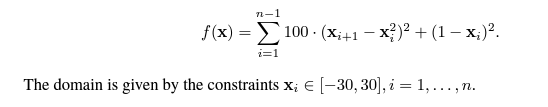
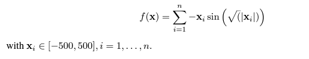

```{r setup, include=FALSE}
knitr::opts_chunk$set(echo = TRUE)
```

# Projekt zaliczeniowy

## Wstępne założenia

Wybraliśmy dwa algorytmy spośród zaproponowanych:

-   **Poszukiwanie przypadkowe (Pure Random Search)**

-   **Algorytm Genetyczny (GA)**

Oraz dwie funkcje z pakietu *smoof*:

-   *Funkcja Rosenbrocka\
    *

-   *Funkcja Schwefela\
    *

Ustawiamy seed, żeby wyniki były powtarzalne dla kolejnych uruchomień.

```{r}
set.seed(2137)
```

Definiujemy również funkcje dla zadanych wymiarów (*n= 2, n=10, n=20)*

```{r echo=TRUE, results='hide', warning=FALSE, error=FALSE, message=FALSE}
library(smoof)
library(GA)
rosenbrock2d <- makeRosenbrockFunction(2)
rosenbrock10d <- makeRosenbrockFunction(10)
rosenbrock20d <- makeRosenbrockFunction(20)

schwefel2d <- makeSchwefelFunction(2)
schwefel10d <- makeSchwefelFunction(10)
schwefel20d <- makeSchwefelFunction(20)
```

## Definiowanie losowych punktów

Funkcja zwracająca losowy punkt dla **rozkładu jednostajnego**. Na podstawie dobranych wyżej funkcji zakładam że dziedziny są symetryczne

```{r echo=TRUE}
getRandomPointInUD <- function(dimensions, domain){
  rndPoint <- replicate(n=dimensions, runif(1,-domain,domain))
  return(rndPoint)
}

```

## Szukanie minimalnej wartości funkcji I

Zgodnie z dokumentacją dla porównania PRS-GA określamy budżet obliczeniowy jako 1000 wywołań. Czyli losujemy 1000 punktów i szukamy najmniejszej wartości.

Definiujemy funkcję odpowiedzialną za szukanie minimum wartości funkcji podanej jako argument. W ten sposób unikniemy powtarzania kodu

```{r}
getSmallestVal <- function(numberOfExec,givenFunc, pointsGenerator, dimensions, domain){
  generatedPoints <- replicate(numberOfExec, pointsGenerator(dimensions, domain))
  pointsMat <- matrix(generatedPoints, nrow = numberOfExec)
  res <- apply(pointsMat, 1, givenFunc)
  return(min(res))
}
```

### Dla PRS

```{r}
Rosenbrock2dResultsPRS <- replicate(50, getSmallestVal(1000, rosenbrock2d, getRandomPointInUD,2,30))

print(mean(Rosenbrock2dResultsPRS))

library(GA)

library(mcreplicate)

varlist <- c('ga', 'rosenbrock2d', 'rosenbrock10d', 'rosenbrock20d',
             'schwefel2d', 'schwefel10d', 'schwefel20d'
             )


Rosenbrock2dResultsGA <- mc_replicate(50, ga("real-valued",fitness = function(x) -rosenbrock2d(x),lower = replicate(2,-30),upper = replicate(2,30),maxiter=1000, run=30, monitor = FALSE)@fitnessValue*-1, varlist = varlist)

print(mean(Rosenbrock2dResultsGA))

```

```{r}
Rosenbrock2dResultsPRS <- replicate(50, getSmallestVal(1000, rosenbrock2d, getRandomPointInUD,2,30))
Rosenbrock10dResultsPRS <- replicate(50, getSmallestVal(1000, rosenbrock10d, getRandomPointInUD,10,30))
Rosenbrock20dResultsPRS <- replicate(50, getSmallestVal(1000, rosenbrock20d, getRandomPointInUD,20,30))

Schwefel2dResultsPRS <- replicate(50, getSmallestVal(1000, schwefel2d, getRandomPointInUD, 2, 500))
Schwefel10dResultsPRS <- replicate(50, getSmallestVal(1000, schwefel10d, getRandomPointInUD, 10, 500))
Schwefel20dResultsPRS <- replicate(50, getSmallestVal(1000, schwefel20d, getRandomPointInUD, 20, 500))

print(Schwefel20dResultsPRS)

MeanRosenbrock2dPRS <- mean(Rosenbrock2dResultsPRS)
MeanRosenbrock10dPRS <- mean(Rosenbrock10dResultsPRS)
MeanRosenbrock20dPRS <- mean(Rosenbrock20dResultsPRS)

MeanSchwefel2dPRS <- mean(Schwefel2dResultsPRS)
MeanSchwefel10dPRS <- mean(Schwefel10dResultsPRS)
MeanSchwefel20dPRS <- mean(Schwefel20dResultsPRS)

```

### Dla GA

```{r}

library(GA)

library(mcreplicate)

varlist <- c('ga', 'rosenbrock2d', 'rosenbrock10d', 'rosenbrock20d',
             'schwefel2d', 'schwefel10d', 'schwefel20d'
             )


Rosenbrock2dResultsGA <- mc_replicate(50, ga("real-valued",fitness = function(x) -rosenbrock2d(x),lower = replicate(2,-30),upper = replicate(2,30),maxiter=1000, run=30, monitor = FALSE)@fitnessValue*-1, varlist = varlist)

print(Rosenbrock2dResultsGA)

#Rosenbrock10dResultsGA <- mc_replicate(50, ga("real-valued",fitness = function(x) -rosenbrock10d(x),lower = replicate(10,-30),upper = replicate(10,30),maxiter=1000, run=30, monitor = FALSE)@fitnessValue*-1, varlist = varlist)

#Rosenbrock20dResultsGA <- mc_replicate(50, ga("real-valued",fitness = function(x) -rosenbrock20d(x),lower = replicate(20,-30),upper = replicate(20,30),maxiter=1000, run=30, monitor = FALSE)@fitnessValue*-1, varlist = varlist)


#Schwefel2dResultsGA <- mc_replicate(50, ga("real-valued",fitness = function(x) -schwefel2d(x),lower = replicate(2,-500),upper = replicate(2,500),maxiter=1000, run=30, monitor = FALSE)@fitnessValue*-1, varlist = varlist)

#Schwefel10dResultsGA <- mc_replicate(50, ga("real-valued",fitness = function(x) -schwefel10d(x),lower = replicate(10,-500),upper = replicate(10,500),maxiter=1000, run=30, monitor = FALSE)@fitnessValue*-1, varlist = varlist)

#Schwefel20dResultsGA <- mc_replicate(50, ga("real-valued",fitness = function(x) -schwefel20d(x),lower = replicate(20,-500),upper = replicate(20,500),maxiter=1000, run=30, monitor = FALSE)@fitnessValue*-1, varlist = varlist)


#MeanRosenbrock2dGA <- mean(Rosenbrock2dResultsGA)
#MeanRosenbrock10dGA <- mean(Rosenbrock10dResultsGA)
#MeanRosenbrock20dGA <- mean(Rosenbrock20dResultsGA)
#MeanSchwefel2dGA <- mean(Schwefel2dResultsGA)
#MeanSchwefel10dGA <- mean(Schwefel10dResultsGA)
#MeanSchwefel20dGA <- mean(Schwefel20dResultsGA)

```

## Wizualizacja otrzymanych wyników

```{r echo=FALSE, message=FALSE, warning=FALSE}
library(ggplot2)
library(plyr)


compareAndVisualize <- function(vec1, vec2, name1, name2){
  df <- data.frame(
  type=factor(rep(c(name1, name2), each=50)),
  result=round(c(vec1, vec2))
  )
  mu <- ddply(df, "type", summarise, grp.mean=mean(result))
  
  p<-ggplot(df, aes(x=result))+
  geom_histogram(color="black", fill="white")+
  facet_grid(type ~ .)+
  geom_vline(data=mu, aes(xintercept=grp.mean, color="mean"),
             linetype="dashed")+
  scale_color_manual(name="statistics", values=c(mean='red'));
  
  vp <- ggplot(df, aes(x=result , y=type)) + geom_violin() + stat_summary(fun = "mean",
               geom = "point",
               aes(color = "Mean")) +

  scale_colour_manual(values = c("red", "blue"), # Colors
                      name = "") # Remove the legend title
  plot(p)
  plot(vp)
}


```

### Funkcja Rosenbrocka 2D

```{r echo=FALSE, message=FALSE, warning=FALSE}
compareAndVisualize(Rosenbrock2dResultsPRS, Rosenbrock2dResultsGA, 'Rosenbrock 2D - PRS', 'Rosenbrock 2D - GA')
```

### Funkcja Rosenbrocka 10D

```{r echo=FALSE, message=FALSE, warning=FALSE}
compareAndVisualize(Rosenbrock10dResultsPRS, Rosenbrock10dResultsGA, 'Rosenbrock 10D - PRS', 'Rosenbrock 10D - GA')
```

### Funkcja Rosenbrocka 20D

```{r echo=FALSE, message=FALSE, warning=FALSE}
compareAndVisualize(Rosenbrock20dResultsPRS, Rosenbrock20dResultsGA, 'Rosenbrock 20D - PRS', 'Rosenbrock 20D - GA')
```

## Porównanie otrzymanych wyników

W poniższej tabeli pokazujemy wartość bezwględną różnicy średnich w otrzymanych wynikach\

```{r}
# declaring a data frame
# declaring a data frame
library(lemon)


df <- data.frame(
  Rosenbrock2D = c(MeanRosenbrock2dPRS, MeanRosenbrock2dGA, abs(MeanRosenbrock2dGA -MeanRosenbrock2dPRS )),
  Rosenbrock10D = c(MeanRosenbrock10dPRS, MeanRosenbrock10dGA, abs(MeanRosenbrock10dGA - MeanRosenbrock10dPRS)),
    Rosenbrock20D = c(MeanRosenbrock20dPRS, MeanRosenbrock20dGA, abs(MeanRosenbrock20dGA - MeanRosenbrock20dPRS)),
  Schwefel2D = c(MeanSchwefel2dPRS, MeanSchwefel2dGA, abs(MeanSchwefel2dGA - MeanRosenbrock2dPRS)),
    Schwefel10D = c(MeanSchwefel10dPRS, MeanSchwefel10dGA, abs(MeanSchwefel10dGA - MeanRosenbrock10dPRS)),
    Schwefel20D = c(MeanSchwefel20dPRS, MeanSchwefel20dGA, abs(MeanSchwefel20dGA - MeanRosenbrock20dPRS))
                 )
  

row.names(df) <- c("PRS", "GA", "Difference")
  
knitr::kable(head(df))
```

## Przedziały ufności

```{r warning=FALSE}


t.test(Rosenbrock2dResultsPRS,Rosenbrock2dResultsGA )
```
